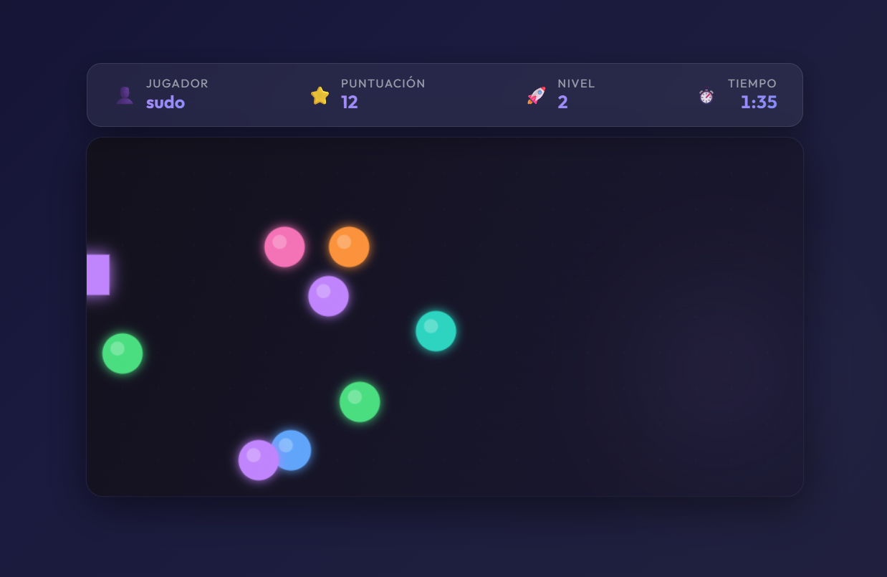

# 🎮 Little Canvas Game

Un juego arcade desarrollado con **HTML5 Canvas** y **JavaScript vanilla**, donde controlas un cuadrado que debe consumir esferas de colores antes de que se acabe el tiempo. Sube de nivel, aumenta tu velocidad y acumula la mayor cantidad de puntos posible.



---

## ✨ Características

- 🕹️ **Movimiento fluido** — Controla el cuadrado con las flechas del teclado en las 4 direcciones.
- 🔄 **Wrapping** — Al salir por un borde del canvas, el cuadrado reaparece por el lado opuesto.
- ⭐ **Sistema de puntuación** — Gana 1 punto por cada esfera consumida. El cuadrado adopta el color de la esfera que consume.
- 🚀 **Niveles progresivos** — Cada vez que consumes las 10 esferas, subes de nivel. La velocidad del cuadrado aumenta y su tamaño se reduce, haciendo el juego más desafiante.
- ⏱️ **Cronómetro de precisión** — Cuenta regresiva de 2 minutos con milisegundos, usando `requestAnimationFrame` para máxima precisión. Los últimos 30 segundos muestran una alerta visual con parpadeo.
- 👤 **Sistema de jugador** — Modal de inicio para ingresar tu nombre, que se muestra en el HUD durante la partida.
- 🏆 **Pantalla de resultados** — Al finalizar el tiempo, un modal muestra tu nombre, puntuación final y nivel alcanzado.
- 🎨 **5 Temas visuales** — Cambia el tema del juego desde el modal de inicio o en tiempo real durante la partida.
- 💎 **Diseño premium** — Interfaz con glassmorphism, gradientes, micro-animaciones, efectos de brillo (glow) y tipografía moderna.

---

## 🎨 Temas Disponibles

| Tema          | Descripción                                               |
| ------------- | --------------------------------------------------------- |
| 🟣 **Nebula** | Púrpura e índigo con ambiente espacial (tema por defecto) |
| 🟢 **Cyber**  | Verde neón estilo cyberpunk                               |
| 🌅 **Sunset** | Rosa y naranja cálido con tonos de atardecer              |
| 🌲 **Forest** | Verde bosque con tonos naturales                          |
| 🧊 **Frost**  | Cian y azul hielo con ambiente ártico                     |

Los temas cambian **toda la interfaz**: fondo de la página, HUD, modales, botones, canvas, y efectos visuales.

---

## 🕹️ Controles

| Tecla                | Acción                   |
| -------------------- | ------------------------ |
| `↑` Flecha Arriba    | Mover hacia arriba       |
| `↓` Flecha Abajo     | Mover hacia abajo        |
| `←` Flecha Izquierda | Mover hacia la izquierda |
| `→` Flecha Derecha   | Mover hacia la derecha   |

---

## 🛠️ Tecnologías

| Tecnología            | Uso                                                           |
| --------------------- | ------------------------------------------------------------- |
| **HTML5**             | Estructura y Canvas                                           |
| **CSS3**              | Estilos, animaciones, temas con custom properties             |
| **JavaScript (ES6+)** | Lógica del juego, sistema de temas, cronómetro                |
| **Canvas API**        | Renderizado del juego (cuadrado, esferas, fondo)              |
| **Google Fonts**      | Tipografía [Outfit](https://fonts.google.com/specimen/Outfit) |

---

## 📁 Estructura del Proyecto

```
little-canvas-game/
├── assets/
│   └── game-preview.png   # Captura de pantalla del juego
├── index.html              # Página principal (estructura HTML)
├── styles.css              # Estilos, temas y animaciones
├── main.js                 # Lógica del juego completa
└── README.md               # Documentación del proyecto
```

---

## 🚀 Instalación y Ejecución

Este proyecto no requiere dependencias ni instalación. Solo necesitas un navegador web moderno.

### Opción 1: Abrir directamente

```bash
# Simplemente abre el archivo index.html en tu navegador
start index.html
```

### Opción 2: Servidor local (recomendado)

```bash
# Con Python
python -m http.server 8080

# Con Node.js (si tienes npx)
npx -y serve .

# Con la extensión Live Server de VS Code
# Click derecho en index.html → "Open with Live Server"
```

Luego visita `http://localhost:8080` en tu navegador.

---

## 🎯 Cómo Jugar

1. **Ingresa tu nombre** en el modal de inicio.
2. **Elige un tema** visual (opcional).
3. Presiona **"Comenzar Juego"** o la tecla **Enter**.
4. Usa las **flechas del teclado** para mover el cuadrado.
5. **Consume las esferas** de colores para sumar puntos.
6. Al consumir las 10 esferas, **subes de nivel** y se generan nuevas esferas.
7. ¡Consigue la mayor puntuación posible antes de que se acaben los **2 minutos**!

---

## �‍💻 Autor

Desarrollado por **[Oliver Zulett](https://github.com/OliverZulett)**

---

## �📝 Licencia

Este proyecto es de uso libre con fines educativos y de entretenimiento.
